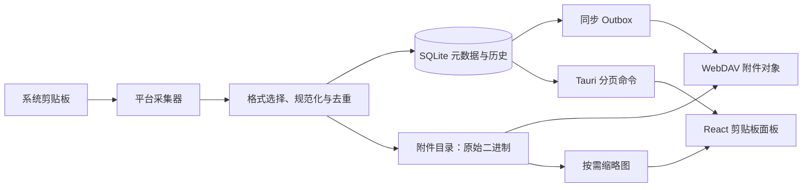

# 剪贴板实现架构

## 数据流

图片二进制不写入 SQLite。数据库中的 `attachments` 只保存内容哈希、MIME、大小和相对路径；
原图保存在应用附件目录，同步时作为独立 WebDAV 对象传输。剪贴板 HTML 使用
`attachment://<id>` 引用图片，`clipboard_attachment_refs` 对引用进行规范化索引，避免在清理、
同步和孤儿检测时反复扫描所有 HTML。

## 采集与格式优先级

- Windows 使用系统 `Clipboard.ContentChanged` 事件，不轮询。事件通过容量 32 的有界队列进入单一
  工作线程，并按系统剪贴板序列号过滤重复通知，避免复制风暴造成无限积压。
- Windows 优先读取注册的原生 `PNG` 格式并直接落盘；没有 PNG 时再读取 RGBA/DIB 并编码。
  这保留截图软件提供的压缩数据，减少一次大图解码和重编码。
- `HTML Format` 按 CF_HTML 的字节偏移解析，不会再把 `Version:1.0 StartHTML:...` 头部当成正文。
- 图文混排优先保存富文本；只有单一图片包装器才归类为图片。纯文本、URL、代码、富文本和图片
  仍共享同一条历史、去重、固定和同步流程。
- macOS/Linux 使用 1.5 秒低频轮询作为兼容路径；移动端只响应用户显式读取，遵循系统隐私限制。

## 存储、引用与回收

- `clipboard_items` 保存规范化文本或 HTML，单条上限 5 MB，最多保留 500 条非删除记录。
- 内容 ID 基于规范化内容的 SHA-256；相同内容再次复制会更新次数和最近时间，而不是复制一整行。
- `clipboard_attachment_refs` 是剪贴板条目到附件的显式多对多引用表。
- 删除、清空、历史裁剪或远端覆盖会把失去引用的附件放入 `attachment_gc_candidates`。清理器再次检查
  便签、版本和剪贴板引用后，才删除原图、缩略图和附件记录，避免误删共享图片。
- 图片预览首次进入视口附近时生成最大 640×480 的 PNG 缩略图。UI 通过本地 asset URL 加载，列表
  不再为每张图片传输 base64，也不会在首屏解码全部原图。

## 查询与前端更新

- 历史命令使用 `LIMIT/OFFSET` 分页，默认每页 50 条；搜索同样分页。
- Windows 自动采集事件携带新增条目，前端直接做有序 upsert，不再每次复制都重新查询整表。
- 卡片使用 `IntersectionObserver` 在接近视口时解析附件，降低长列表的文件 IO 与图片解码开销。
- 富文本渲染会清理脚本、事件属性和危险 URL。远程 HTTP 图片不会自动加载，避免打开历史时泄露
  IP 或触发跟踪；普通 HTTPS 链接仍可点击。

## 写回系统剪贴板

- 图片条目同时写入系统图片格式、HTML 和纯文本回退，Windows 剪贴板历史可识别为图片。
- 富文本只执行一次原子写入；其中的本地 `attachment://` 图片在写出边界转换为 data URL，使外部应用
  能粘贴完整图文内容。数据库和 UI 内部仍使用附件引用，不持久化 base64。
- 应用自身写回期间暂停采集并更新内容指纹，避免形成反馈循环。

## 同步与平台边界

剪贴板条目继续复用 SQLite outbox、WebDAV 和版本向量；附件先作为独立对象上传，条目只同步引用。
并发固定、删除和更新使用因果版本裁决，不依赖设备墙钟决定胜负。远端 change 是服务端可读 JSON，
尚未提供端到端加密，高敏感数据仍应配置排除或在后续增加加密层。

Windows 需要覆盖文本、CF_HTML、单图、图文混排、大尺寸截图以及截图软件快捷键；macOS、Linux、
Android 和 iOS 的系统权限与真实格式仍需在对应平台 CI 或真机完成最终验收。
